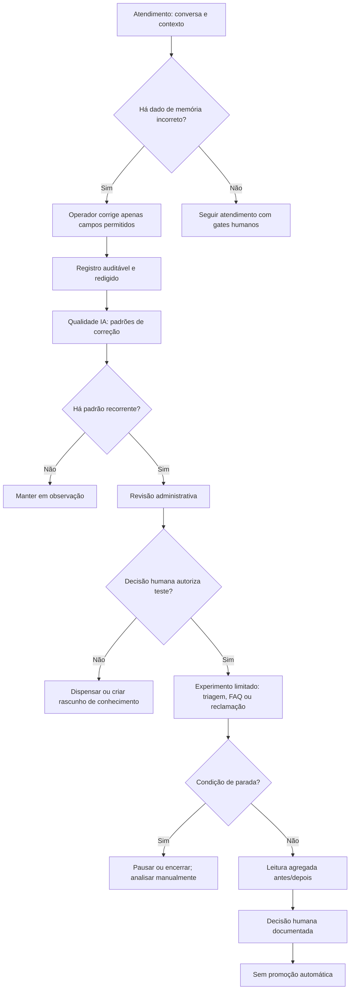

# Guia de Utilização — Contexto Supervisionado do Agente

**Público:** administradores e operadores autorizados.
**Objetivo:** usar as capacidades de contexto, revisão e experimentos para melhorar o atendimento sem ampliar a autonomia do agente.

> A IA pode organizar fatos, preparar respostas e sinalizar padrões. **Ela não confirma pagamentos, não conclui agendamentos, não autoriza reembolsos, descontos ou exceções, e não envia comunicações sensíveis sem o gate humano aplicável.**

## Visão geral

A operação é organizada como um ciclo supervisionado. A correção de um operador pode gerar uma evidência auditável; evidências recorrentes podem ser encaminhadas para revisão; um experimento limitado pode observar um ajuste; e o resultado agregado apoia a decisão humana. Nenhuma etapa publica uma mudança automaticamente.

## 1. Atendimento: consultar e corrigir o contexto

Na área **Atendimento**, abra a conversa e consulte o painel de contexto. Ele reúne a memória estruturada do contato, os estados vivos relevantes e o trace redigido dos turnos do agente. O painel serve para explicar o que o agente considerou no atendimento; não substitui a revisão humana.

| Ação do operador | Quando usar | Registro e limite |
| --- | --- | --- |
| **Consultar memória** | Antes de responder ou corrigir uma informação persistida. | Verifique se o dado pertence à conversa e ao contato corretos. |
| **Corrigir memória** | Quando nome, idioma, intenção, interesse, objeção ou próximo passo estiverem incorretos. | A ação gera evento auditável. Não altere estados vivos por esse painel. |
| **Consultar trace** | Quando for necessário entender uma resposta do agente. | O trace é redigido e não deve ser usado para expor mensagens, prompts ou dados sensíveis. |
| **Escalonar** | Quando houver pagamento, agenda, reembolso, desconto, exceção, risco ou comunicação sensível. | O gate humano continua obrigatório. |

Os campos permitidos para correção manual são **nome preferido**, **idioma**, **intenção atual**, **interesse de serviço**, **objeções** e **próximo passo recomendado**. Não use a memória para substituir a situação real de uma agenda, de um pagamento ou de um escalonamento.

## 2. Qualidade IA: observar padrões sem aplicar mudanças

Abra **Melhorias do atendimento → Memória**. A tela apresenta contagens agregadas de correções e uma fila de padrões para revisão. Ela não expõe o conteúdo das conversas nem valores que o operador corrigiu.

Quando houver evidência suficiente, a fila permite quatro encaminhamentos administrativos:

| Decisão | Uso recomendado | Efeito automático |
| --- | --- | --- |
| **Manter em observação** | O padrão ainda não é claro ou exige mais evidência. | Nenhum. |
| **Rascunho de conhecimento** | A correção aponta uma lacuna de informação que precisa ser escrita e revisada. | Nenhum. |
| **Teste controlado** | Existe uma hipótese concreta, limitada e reversível para triagem, FAQ ou reclamação. | Nenhum. |
| **Dispensar** | O padrão não é relevante, seguro ou acionável. | Nenhum. |

Registre uma nota objetiva que explique a decisão. Evite inserir telefone, mensagem completa, comprovantes ou informações pessoais na observação administrativa.

## 3. Experimentos controlados: desenhar, acompanhar e parar

Abra **Melhorias do atendimento → Experimentos**. O experimento é um protocolo de observação, não um mecanismo de promoção automática. Ele só pode usar as rotas **Triagem**, **Dúvidas e informações (FAQ)** e **Reclamação**. **Agendamento fica fora do escopo.**

### 3.1 Criar o rascunho

Escolha um item de Qualidade que esteja em teste e preencha a hipótese, o resumo da variação, as rotas permitidas, a amostra, os critérios de sucesso e as condições de parada. A amostra deve ficar entre **1 e 25** atendimentos. Use somente uma hipótese observável por experimento.

| Campo | Como preencher de forma segura |
| --- | --- |
| **Hipótese** | Descreva a relação a observar, sem prometer causalidade. Ex.: “Uma abertura mais objetiva pode reduzir correções na rota de FAQ”. |
| **Resumo da variação** | Informe a mudança de forma curta e sem incluir prompt completo, dados pessoais ou conteúdo sensível. |
| **Rotas** | Selecione somente Triagem, FAQ e/ou Reclamação. |
| **Amostra** | Defina um limite pequeno, entre 1 e 25. |
| **Critérios** | Indique os sinais que serão revisados por uma pessoa. |
| **Condições de parada** | Registre os gatilhos que exigem interrupção ou revisão imediata. |

### 3.2 Transições de estado

O ciclo disponível é **Rascunho → Pronto para avaliação → Em acompanhamento manual → Pausado ou Concluído/Encerrado**. Cada transição é registrada e exige uma ação humana.

> Antes de iniciar, verifique novamente se a hipótese não reduz nenhum gate de pagamento, agenda, reembolso, desconto, exceção, escalonamento ou comunicação sensível.

### 3.3 Paradas obrigatórias

Pause ou encerre o experimento quando houver qualquer sinal de pagamento ou confirmação de agenda; escalonamento humano, incidente sensível ou risco de segurança; ou aumento de respostas bloqueadas, inseguras ou incorretas. Documente a decisão e prossiga pela revisão humana apropriada.

## 4. Leitura antes/depois: interpretar sem confundir sinal com prova

Em um experimento que já iniciou, selecione **Atualizar leitura**. O painel mostra uma comparação entre uma janela anterior e outra posterior de mesma duração. A duração observada fica entre **1 hora e 14 dias**, conforme o período disponível do experimento.

| Indicador agregado | Leitura | Direção de atenção |
| --- | --- | --- |
| **Correções humanas** | Quantidade de correções auditáveis de memória no período. | Menor é melhor. |
| **Escalonamentos** | Quantidade de escalonamentos criados no período. | Menor é melhor. |
| **Respostas bloqueadas** | Conversas em que a IA foi bloqueada no período. | Menor é melhor. |

O resultado traz apenas contagens agregadas por tenant e período. Ele não retorna telefone, mensagem, prompt, comprovante, hipótese, variação, notas nem valores corrigidos.

> **Importante:** uma melhora ou piora nesses números não prova causalidade. Considere volume, sazonalidade, tipo de demanda, incidentes paralelos e qualidade da amostra antes de concluir.

## 5. Concluir e registrar a decisão humana

Ao concluir ou encerrar um experimento, registre um resumo do resultado e uma nota de decisão. A decisão pode orientar um novo rascunho, uma revisão de conhecimento ou uma investigação adicional. Ela não ativa variações, não altera o prompt e não modifica o comportamento do agente automaticamente.

Use esta lista de verificação antes de fechar o caso:

- A hipótese, a amostra e as rotas permaneceram dentro do escopo autorizado.
- As condições de parada foram verificadas e, se aplicável, acionadas.
- A leitura agregada foi interpretada como sinal, não como prova causal.
- O resumo não contém dados pessoais, mensagens, prompts, comprovantes ou conteúdo sensível.
- A decisão humana foi registrada e os gates de alto impacto permaneceram inalterados.

## Papéis e responsabilidades

| Papel | Responsabilidade principal |
| --- | --- |
| **Operador** | Corrigir os campos de memória permitidos, revisar contexto e escalar situações sensíveis. |
| **Administrador de Qualidade** | Avaliar padrões, criar protocolos limitados, acompanhar resultados e registrar decisões. |
| **Agente de IA** | Consultar fatos disponíveis, preparar respostas e respeitar os gates humanos. |
| **Responsável humano aplicável** | Confirmar ações de alto impacto, como pagamento, agenda, reembolso, desconto, exceção e comunicações sensíveis. |

## Referências internas

[1] [Central de Qualidade e Experimentos](../src/components/QualityAuditCenter.tsx)
[2] [Cálculo redigido dos resultados do experimento](../server/services/controlledExperimentResults.ts)
[3] [Montagem do Context Pack do agente](../server/services/agentContextPack.ts)
[4] [Armazenamento de memória supervisionada](../server/services/contactAgentMemoryStore.ts)
