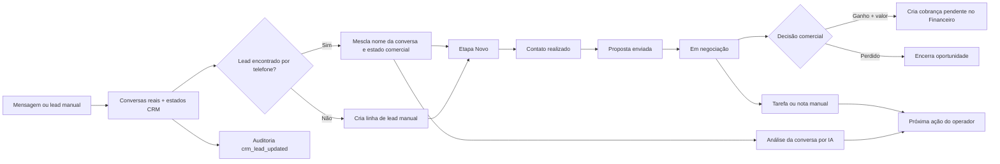

# CRM — mapa de processos, automações e proposta de refinamento

## Escopo analisado

A análise cobre o `OperatorCRM`, a rota `/api/crm/leads`, a persistência de estados do lead, a ponte CRM → Financeiro, a atualização periódica no frontend e os jobs de follow-up, lembrete e expiração relacionados ao ciclo comercial. A Agenda será refinada somente depois que este diagnóstico for concluído.

## Diagnóstico executivo

O CRM já possui o núcleo operacional necessário: recebe conversas reais, combina essas conversas com estados comerciais persistidos, permite mover o lead por seis etapas, registrar tarefas e notas, abrir o WhatsApp e encaminhar um negócio ganho ao Financeiro. O problema principal não é falta de função; é **concentração excessiva de responsabilidades numa única tela** e pouca separação entre acompanhamento, filtros, pipeline e detalhe do cliente.

No mobile, a tela atual empilha cabeçalho, ações, quatro métricas, busca, filtro, seis colunas do kanban ou uma tabela larga e, por fim, um drawer detalhado. Isso força rolagem para chegar à próxima ação. A organização recomendada é um workspace com menu interno e uma tarefa principal por seção.

## Mapa do processo atual

A fonte de verdade do lead é composta por conversa real e estado CRM. O telefone é a chave de conciliação. A API impede que uma conversa real e um cadastro manual apareçam como duas oportunidades quando usam o mesmo telefone.

## Responsabilidades encontradas

| Camada | O que faz hoje | Observação operacional |
| --- | --- | --- |
| Entrada | `GET /api/crm/leads` combina conversas e `crm_lead_state` | Conversas sem estado persistido aparecem como `novo`, mas só gravam estado após interação. |
| Funil | Seis etapas: novo, contato, proposta, negociação, ganho e perdido | A troca pode ser feita no card ou no detalhe. |
| Qualificação | Nome, telefone, origem, resumo, probabilidade e valor negociado | O valor desconhecido é exibido como “Sem valor”; não deve virar estimativa falsa. |
| Execução humana | Tarefas, notas, WhatsApp e encaminhamento ao Financeiro | Tarefas e notas são controles manuais, sem SLA ou responsável visível além do operador. |
| Persistência | `PATCH /api/crm/leads/:phone` grava mudanças | A atualização é por telefone e também registra auditoria. |
| Financeiro | Etapa `ganho` com valor cria cobrança `pendente` | `sourceRef=crm-won:<phone>` garante idempotência por tenant. |
| Atualização da tela | App consulta leads a cada 8 segundos | Funciona como polling, mas pode gerar carga e não comunica claramente o estado de sincronização. |

## Automações existentes

| Gatilho | Ação automática | Proteção | Limite atual |
| --- | --- | --- | --- |
| Lead muda para `ganho` com valor | Cria transação pendente no Financeiro | Verifica módulo ativo e `sourceRef` único | Não cria pagamento confirmado; exige confirmação real. |
| Nova alteração no CRM | Registra evento de auditoria | Falha de auditoria não bloqueia o CRM | Não existe timeline operacional visual para o operador. |
| Pré-reserva chega à data combinada | Alerta o operador | Marca `followup_alerted_at` e não duplica alerta | Não envia mensagem nem confirma horário automaticamente. |
| Agendamento se aproxima | Envia lembrete por template WhatsApp ou canal Evolution | Job periódico e marcação para evitar duplicidade | Só alcança agendamentos com telefone e origem compatível. |
| Pré-reserva ou pagamento fica pendente | Jobs alertam ou expiram conforme o fluxo | Passadas idempotentes e lock de job | A interface do CRM não mostra uma fila unificada de pendências. |
| Conversas e estados mudam | Frontend atualiza por polling | Intervalo fixo de 8 segundos | Pode haver atraso, chamadas repetidas e ausência de indicador de última sincronização. |

## Lacunas e riscos prioritários

### 1. O CRM não tem uma fila explícita de próxima ação

A IA pode recomendar uma ação e o operador pode criar uma tarefa, mas a tela não transforma isso numa fila priorizada por vencimento, etapa ou risco. O resultado é que tarefas, notas, conversa e agenda ficam distribuídas entre o drawer, WhatsApp e outras áreas.

### 2. A automação está espalhada entre CRM, conversas, Agenda e jobs

Isso é correto do ponto de vista de domínio, mas difícil para operação. O CRM deveria apresentar o estado agregado: “aguardando resposta”, “proposta sem retorno”, “pré-reserva vencendo”, “pagamento pendente” e “próxima ação hoje”. A tela não precisa executar tudo; precisa orientar o operador para o próximo passo certo.

### 3. A atualização por polling precisa de contexto

O polling de 8 segundos é uma solução funcional, porém o operador não vê quando os dados foram sincronizados nem se uma alteração local está aguardando confirmação do servidor. A melhoria recomendada é adicionar estado de sincronização e evitar múltiplas chamadas quando a aba estiver em segundo plano.

### 4. Ações destrutivas estão próximas das ações de operação

“Limpar todos” apaga leads reais e é irreversível. Mesmo com confirmação textual, deve ficar em uma área administrativa secundária, fora do cabeçalho da operação diária, e indicar a quantidade, tenant e consequência.

### 5. A etapa `ganho` dispara efeito financeiro importante

A criação da cobrança pendente é adequada e idempotente, mas a interface deve deixar claro que mover para “Ganho” cria uma pendência financeira. O operador não deve interpretar a ação como pagamento recebido.

## Menu interno recomendado para o CRM

| Seção | Conteúdo | Objetivo mobile |
| --- | --- | --- |
| **Hoje** | Próximas ações vencendo, leads sem retorno e pendências críticas | Abrir a tela já orientado pelo que precisa ser feito. |
| **Pipeline** | Kanban compacto ou lista de leads com etapa, valor e origem | Acompanhar o funil sem renderizar todos os detalhes ao mesmo tempo. |
| **Filtros** | Busca, etapa, origem, responsável, valor conhecido e pendência | Ajustar o recorte sem ocupar o topo permanentemente. |
| **Atividades** | Tarefas e notas do operador, com vencimento e status | Tirar o controle de tarefas de dentro de um drawer longo. |
| **Detalhe** | Conversa, análise de IA, histórico, WhatsApp, Financeiro e mudança de etapa | Abrir somente para o lead selecionado. |
| **Configurações** | Preferências de visão, colunas e ações administrativas | Retirar “Limpar todos” e preferências da operação diária. |

A seção inicial deve ser **Hoje**, não o kanban completo. No mobile, o menu deve ser horizontal em um único container, com `aria-current` na seção ativa. No desktop, pode permanecer como uma faixa compacta acima do conteúdo. A troca de seção deve alterar a apresentação, não duplicar a consulta ao backend.

## Plano de automação recomendado

### Fase 1 — consolidar visibilidade, sem criar novas ações automáticas

Exibir no CRM uma fila derivada dos dados que já existem: tarefas abertas, recomendação da IA, leads em negociação sem atividade recente, pré-reservas pendentes e cobranças criadas após ganho. Essa fase é segura porque não envia mensagens nem altera estados sozinha.

### Fase 2 — criar regras explícitas e auditáveis

Adicionar uma camada de regras configuráveis por tenant, com gatilho, condição, ação, intervalo de espera, responsável e estado. Exemplos: “quando entrar em negociação e não houver atividade por 24 horas, criar tarefa”; “quando proposta for enviada, lembrar o operador no próximo dia útil”; “quando ganho for marcado, mostrar confirmação da cobrança pendente”. Toda regra deve possuir idempotência e log.

### Fase 3 — automatizar comunicação somente com autorização

Mensagens proativas devem usar templates aprovados quando a janela de atendimento exigir. O CRM deve mostrar prévia, canal, destinatário, horário e opção de pausar a regra. Não enviar mensagem automática ao cliente apenas porque uma etapa mudou, sem definir consentimento, template e fallback humano.

## Critérios de implementação futura

A implementação deve preservar o isolamento por `tenant_id`, a conciliação por telefone, a idempotência financeira e a auditoria. Qualquer nova automação precisa ser determinística quando não requer julgamento, ter proteção contra duplicidade, registrar sucesso/erro e permitir intervenção humana.

O próximo trabalho recomendado no CRM é a compactação visual com o menu interno acima, começando por **Hoje**, **Pipeline** e **Detalhe**. Depois de validar essa entrega, iniciar a Agenda com o mesmo workflow: auditar a tela atual, separar rotina diária de calendário, preservar os lembretes e reduzir a rolagem no mobile.

## Decisão recomendada

**Não criar novos jobs ainda.** Primeiro consolidar a visualização das automações existentes e separar a operação em menu interno. Isso reduz complexidade sem alterar o comportamento de produção. Depois, implementar regras configuráveis apenas para lacunas comprovadas, começando por tarefas internas e alertas ao operador antes de qualquer mensagem automática ao cliente.
