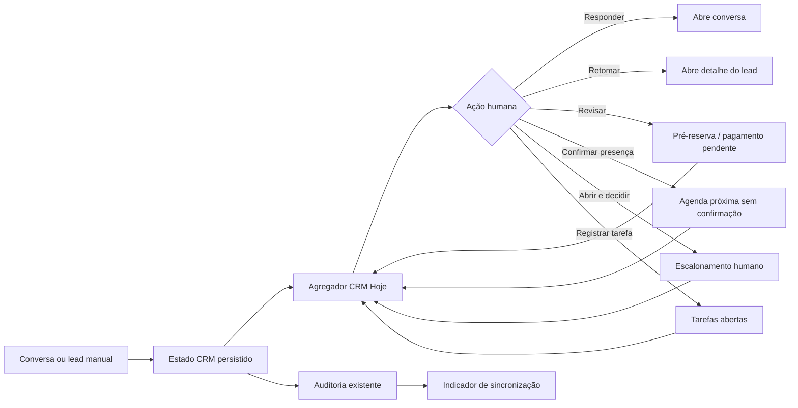

# Plano consolidado — uma PR para CRM Hoje e UI operacional

**Produto:** Universo Conectado  
**Data:** 27 de agosto de 2026  
**Base:** avaliação de experiência de uso intenso, diagnóstico do CRM e refinamentos recentes da Agenda  
**Objetivo:** transformar a próxima evolução do CRM em uma única PR coerente, revisável e segura, sem distribuir a mesma mudança em várias branches ou introduzir automações de alto risco.

## 1. Decisão de escopo

A PR única deve entregar uma fatia vertical completa da operação: **CRM Hoje**, evolução mínima das tarefas, feedback de sincronização e reorganização visual do CRM com menu interno. A Agenda não será reimplementada nesta PR porque seu menu Hoje/Calendário/Pendências e a compactação mobile já foram integrados anteriormente; ela será usada como padrão visual e de navegação, não como novo escopo funcional.

A PR deve começar em leitura e orientação. Não deve criar jobs novos, enviar mensagens automáticas ao cliente, mover leads de forma automática, confirmar pagamentos nem alterar a regra financeira existente. A fila deve tornar visíveis as pendências que já existem e abrir o contexto correto para uma decisão humana.

| Incluído na PR única | Não incluído nesta PR |
|---|---|
| Seção CRM **Hoje** como entrada padrão no mobile e faixa compacta no desktop. | Nova automação de mensagens para clientes. |
| Fila intermodular derivada de dados existentes. | Novos jobs periódicos de follow-up ou lembrete. |
| Menu interno **Hoje / Pipeline / Filtros / Atividades / Detalhe / Configurações**. | Regras configuráveis de automação por tenant. |
| Tarefas com data/hora, responsável, tipo e prioridade. | Confirmação automática de reserva, pagamento ou etapa. |
| Estados de sincronização: sincronizado, salvando, falhou. | Reescrita da Agenda ou nova alteração visual fora do CRM. |
| Remoção de “Limpar todos” da rotina operacional. | Migração estrutural de banco sem necessidade comprovada. |
| Preferência inicial de densidade, se não exigir alteração de persistência. | Atalhos de teclado globais e omnibox. |

## 2. Diagnóstico reavaliado

A avaliação de uso intenso atribui **8,8/10** ao produto. O atendimento e as decisões recentes de mobile estão bem resolvidos; o gargalo restante é operacional: o operador precisa lembrar em qual módulo procurar a próxima tarefa. O CRM possui dados, tarefas, notas, etapas, conversas, agenda e efeitos financeiros, mas ainda não apresenta uma fila curta com prioridade, prazo, responsável e ação direta.

A prioridade correta é, portanto, **organização antes de automação**. A primeira versão deve consolidar o estado das automações que já existem, sem alterar seus gatilhos. Isso reduz carga cognitiva, preserva segurança e permite validar a utilidade da fila antes de conectar novos efeitos colaterais.

## 3. Mapa de processo alvo



A fila não será uma nova fonte de verdade. Ela será uma projeção dos estados e eventos já existentes, com deduplicação por `tenant_id` e telefone quando o item representar um lead. Cada item deve apontar para uma rota ou estado já existente, evitando duplicar lógica de conversa, financeiro, agenda ou escalonamento.

## 4. Conteúdo mínimo da fila CRM Hoje

| Prioridade | Tipo | Dados mínimos | Ação primária | Fonte |
|---:|---|---|---|---|
| 1 | Comprovante pendente ou reserva em risco | Cliente, horário, valor/sinal, tempo restante e status. | Revisar comprovante. | Estados de pagamento/pré-reserva existentes. |
| 2 | Escalonamento humano aberto | Cliente, motivo, última mensagem e tempo em aberto. | Abrir e decidir. | Escalonamentos existentes. |
| 3 | Conversa aguardando resposta | Cliente, última mensagem, origem e tempo de espera. | Responder. | Conversas e estado de atendimento. |
| 4 | Proposta ou negociação sem atividade | Cliente, etapa, valor conhecido, última atividade e prazo. | Retomar. | `crm_lead_state` e tarefas. |
| 5 | Agenda próxima sem confirmação | Cliente, serviço, horário e status de confirmação. | Confirmar presença. | Google Calendar e pagamento vinculado. |

A ordem inicial deve ser determinística: risco financeiro e prazo vencendo primeiro, depois escalonamento, conversa aguardando resposta, negociação sem atividade e agenda próxima. Quando não houver dados suficientes, exibir “Sem prazo”, “Sem valor” ou “Sem responsável”; nunca gerar estimativas implícitas.

## 5. Arquitetura de interface

O CRM deve iniciar na seção **Hoje**, não no kanban completo. O menu interno será horizontal e compacto, com `aria-current="page"`, e não deve disparar consultas duplicadas ao alternar entre visões.

| Seção | Responsabilidade | Regra de densidade |
|---|---|---|
| Hoje | Próximas ações agregadas e pendências críticas. | Uma lista curta, uma ação dominante por item. |
| Pipeline | Kanban/lista de leads por etapa. | Métricas secundárias recolhidas ou ocultáveis. |
| Filtros | Busca, etapa, origem, responsável, valor e pendência. | Abre sob demanda, não ocupa permanentemente o topo. |
| Atividades | Tarefas e notas com prazo, dono, tipo e prioridade. | Lista operacional, sem drawer longo. |
| Detalhe | Conversa, IA, histórico, WhatsApp, financeiro e etapa. | Um lead por vez, sob demanda. |
| Configurações | Colunas, densidade e administração. | “Limpar todos” fora da rotina comercial. |

No mobile, o CRM deve renderizar uma seção por vez. No desktop, a fila pode ocupar a área principal e o detalhe abrir em painel lateral ou região adjacente. Hero, quatro cards de métricas e ações secundárias não devem competir com a fila de trabalho.

## 6. Evolução das tarefas

A tarefa deixa de ser apenas um registro textual e passa a ser uma unidade mínima de execução. O formulário deve pedir apenas o necessário: **data/hora, responsável, tipo de ação e prioridade**. O padrão pode sugerir o próximo horário útil, mas o operador deve conseguir alterar cada campo em poucos toques.

A tarefa deverá expor estado aberto, concluído ou atrasado e aparecer na fila CRM Hoje quando cumprir uma regra clara de vencimento ou prioridade. A atribuição continua isolada por tenant. Se o modelo atual não possuir tabela ou contrato para responsável e prioridade, a implementação deve preferir extensão compatível ao invés de criar uma migração ampla sem necessidade.

## 7. Feedback de sincronização

O CRM usa atualização periódica e ações assíncronas. A interface precisa distinguir estado local de confirmação do servidor sem inundar o operador com toasts.

| Estado | Exibição | Comportamento |
|---|---|---|
| Sincronizado | “Sincronizado agora” + horário curto. | Atualiza após consulta bem-sucedida. |
| Salvando | “Salvando…” próximo da ação. | Desabilita apenas a ação em andamento. |
| Confirmado | “Alteração salva”. | Some ou reduz após curto período. |
| Falhou | “Não foi confirmado — tentar de novo”. | Mantém contexto e permite retry idempotente. |

O polling deve evitar consultas concorrentes, reduzir atividade quando a aba estiver oculta e não substituir o estado otimista por dados antigos sem controle. A implementação não deve alterar o intervalo global sem medir impacto; primeiro deve tornar o estado perceptível e seguro.

## 8. Segurança e automação

“Limpar todos” deve sair do cabeçalho e das ações operacionais do CRM. A ação deve ficar em Configurações administrativas, indicar tenant, quantidade e consequência e exigir permissão administrativa reforçada. A confirmação textual isolada não é suficiente para uma operação de alto volume.

A PR não deve criar automações externas. As automações existentes continuam responsáveis por lembretes, expiração, auditoria e criação idempotente da pendência financeira quando um lead ganho possui valor. A fila apenas agrega seus efeitos e encaminha para revisão humana.

Qualquer fase posterior de regras configuráveis deverá exigir, antes de enviar ou alterar algo: gatilho, condição, ação, atraso, dono, tenant, idempotência, log de sucesso/erro, pausa manual e fallback humano. Mensagens proativas exigirão template aprovado, consentimento, canal, destinatário, prévia e janela de atendimento.

## 9. Ordem de implementação dentro da mesma PR

A PR deve ser executada em commits pequenos, porém todos dentro da mesma branch e revisão.

| Ordem | Bloco | Resultado verificável |
|---:|---|---|
| 1 | Contratos e agregador CRM Hoje | Tipo único para item de fila, fontes deduplicadas e ordenação determinística. |
| 2 | Menu interno e entrada Hoje | CRM abre na fila, com navegação acessível e sem consultas duplicadas. |
| 3 | Cards de fila e ações de abertura | Cada tipo abre o contexto correto com um CTA primário. |
| 4 | Tarefas enriquecidas | Prazo, dono, tipo, prioridade e estado aparecem no CRM Hoje. |
| 5 | Feedback de sincronização | Salvando, sincronizado e falhou aparecem junto das ações. |
| 6 | Segurança e densidade | “Limpar todos” sai da rotina; métricas e detalhes deixam de dominar o mobile. |
| 7 | Testes e documentação | Contratos, navegação, ordenação, permissões e regressões cobertos. |

## 10. Critérios de aceite da PR única

A PR só estará pronta quando todos os critérios abaixo forem verificáveis.

| Área | Critério de aceite |
|---|---|
| Entrada | O CRM abre em Hoje no mobile e preserva uma entrada equivalente no desktop. |
| Fila | Os cinco tipos de pendência podem aparecer sem duplicar o mesmo lead ou evento. |
| Abertura | Cada item leva diretamente à conversa, detalhe, comprovante, agenda ou escalonamento correspondente. |
| Ordenação | A ordem é estável, explicável e baseada em risco, prazo e tempo sem atividade. |
| Tarefas | Uma tarefa criada com prazo, responsável, tipo e prioridade aparece corretamente na fila. |
| Sincronização | O operador distingue salvamento local, confirmação e falha com retry. |
| Segurança | “Limpar todos” não aparece na operação comercial e continua protegido administrativamente. |
| Financeiro | Mover para `ganho` continua criando apenas cobrança pendente de forma idempotente. |
| Automação | Nenhuma mensagem ou alteração automática nova é disparada pela PR. |
| Mobile | Não há hero ou bloco gigante empurrando a fila; ações principais ficam acessíveis sem rolagem excessiva. |
| Acessibilidade | Menu ativo expõe `aria-current`, controles têm nome acessível e foco visível. |
| Multi-tenant | Consultas, ações e projeções permanecem isoladas por `tenant_id`. |

## 11. Estratégia de testes

Os testes de unidade devem cobrir o agregador da fila, a deduplicação por telefone/tenant, a ordenação por prioridade, os estados vazios e a ausência de estimativas quando o valor ou prazo não existe. Os testes de componente devem cobrir entrada na seção Hoje, troca de menu, filtros, abertura do contexto correto, tarefa enriquecida e estados de sincronização.

Os testes de segurança devem garantir que uma role comercial não veja nem execute “Limpar todos”, que o ganho financeiro mantenha `sourceRef` idempotente e que um tenant não leia nem altere itens de outro tenant. Os testes existentes de Agenda e atendimento devem permanecer aprovados, pois a PR reutilizará padrões de menu e densidade sem modificar seus contratos.

A validação mínima antes de solicitar revisão será:

```text
npm run lint
npm test
npm run build
git diff --check
```

A validação visual deve usar pelo menos uma viewport mobile e uma desktop, conferindo que a primeira ação útil aparece sem rolagem longa, que o detalhe continua acessível e que métricas secundárias não dominam a tela.

## 12. Riscos e decisões de contenção

| Risco | Contenção |
|---|---|
| Fila virar uma segunda fonte de verdade | Agregador somente leitura e ações encaminhadas aos contratos existentes. |
| Duplicação de conversas e leads | Deduplicação por `tenant_id` e telefone, com prioridade para conversa real. |
| Ação financeira interpretada como pagamento | Copy explícita: ganho cria cobrança pendente, não pagamento confirmado. |
| Polling piorar carga | Evitar concorrência e pausar/reduzir em aba oculta antes de alterar frequência. |
| PR grande demais para revisão | Um objetivo único, commits por bloco e escopo fora da Agenda. |
| Automação disparar efeito inesperado | Nenhum job novo; apenas projeção e revisão humana. |
| Mobile ficar denso demais | Uma seção visível por vez, CTA dominante e métricas ocultáveis. |
| Esquema de dados incompatível | Reutilizar contratos; migrar apenas se o modelo atual não comportar tarefa enriquecida. |

## 13. Definição de pronto e estratégia de integração

A branch da PR deve partir de `origin/main` atualizada. O diff deve conter somente o CRM Hoje, a evolução necessária das tarefas, o feedback de sincronização, a proteção administrativa e os testes/documentação correspondentes. A Agenda e os fixes já mesclados não devem ser reaplicados.

A PR deverá ter descrição com escopo incluído/excluído, screenshots mobile/desktop, lista de testes e nota explícita de que não há novas automações externas. O merge só ocorrerá após checks verdes e autorização explícita. Depois do merge, deve-se observar uso real com operadores antes de iniciar a fase de regras automáticas configuráveis.

> **Resumo executivo:** uma única PR deve primeiro tornar visível a próxima ação, depois tornar tarefas e sincronização confiáveis e, por fim, reduzir o ruído visual. Automação de cliente fica para depois da validação da fila.

## Referências internas

[1]: `Avaliação_de_Experiência_de_Uso_Intensivo_—_Operad.md` — avaliação de uso intenso, 27/08/2026.  
[2]: `docs/crm-processo-e-automacao-2026-08-27.md` — mapa do CRM, automações existentes e lacunas.  
[3]: `docs/agenda-refinamento-2026-08-27.md` — padrão de menu Hoje/Calendário/Pendências e preservação de integrações.
